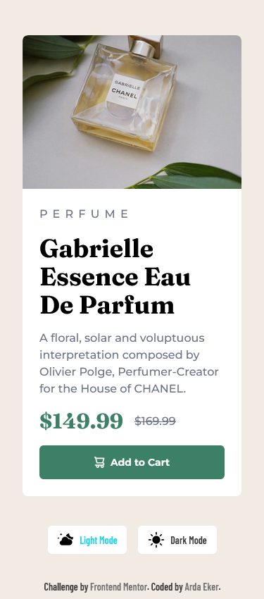

# Frontend Mentor - Product preview card component solution

This is a solution to the [Product preview card component challenge on Frontend Mentor](https://www.frontendmentor.io/challenges/product-preview-card-component-GO7UmttRfa). Frontend Mentor challenges help you improve your coding skills by building realistic projects.

## Table of contents

- [Frontend Mentor - Product preview card component solution](#frontend-mentor---product-preview-card-component-solution)
  - [Table of contents](#table-of-contents)
  - [Overview](#overview)
    - [The challenge](#the-challenge)
    - [Screenshot Desktop](#screenshot-desktop)
    - [Screenshot Mobile](#screenshot-mobile)
    - [Links](#links)
  - [My process](#my-process)
    - [Built with](#built-with)
  - [Author](#author)

## Overview

### The challenge

Users should be able to:

- View the optimal layout depending on their device's screen size
- See hover and focus states for interactive elements

### Screenshot Desktop

### Screenshot Mobile

### Links

- Solution URL: [Solution URL here](https://www.frontendmentor.io/solutions/product-preview-card-component-with-tailwind-css-lightdark-theme-K47HaRFeay)
- Live Site URL: [Live site URL here](https://ardaekerfrontendmentor-01.netlify.app/)

## My process

### Built with

- Semantic HTML5 markup
- Flexbox
- CSS Grid
- Mobile-first workflow
- [Tailwind CSS](https://tailwindcss.com/)

## Author

- LinkedIn [@ardaeker](https://www.linkedin.com/in/ardaeker/)
- GitHub [@ardaeker](https://github.com/ardaeker)
- Frontend Mentor - [@ardaekerFD](https://www.frontendmentor.io/profile/ardaekerFD)
